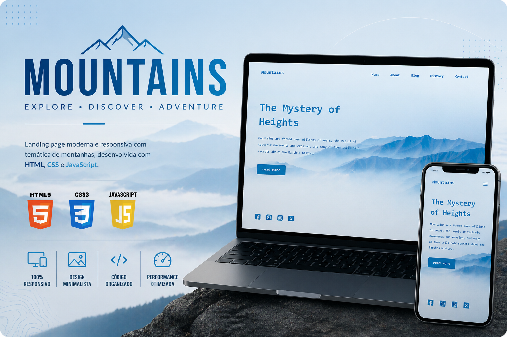

# 🏔️ Mountains

<p align="center">
  
</p>

<p align="center">
  <a href="https://gabrieldosantosribeiro.github.io/mountains-page/" target="_blank">
    
  </a>
</p>

---

## 🌐 Acesse o projeto

Você pode visualizar o projeto funcionando aqui:

👉 https://gabrieldosantosribeiro.github.io/mountains-page/

---

## 📖 Sobre o projeto

Este projeto consiste em uma **landing page com temática de montanhas**, desenvolvida totalmente do zero utilizando **HTML, CSS e JavaScript**.

O foco foi criar uma interface visualmente agradável, explorando imagens, tipografia e organização de conteúdo.

---

## 🚀 Tecnologias utilizadas

* HTML5
* CSS3
* JavaScript

---

## 💡 Funcionalidades

* Layout moderno e minimalista
* Navegação entre seções
* Estrutura de landing page
* Interface responsiva
* Destaque para imagens e conteúdo visual

---

## 📂 Estrutura do projeto

```bash id="h5g2lp"
mountains-page/
│
├── index.html
├── style.css
├── script.js
│
├── assets/
│   └── banner.png
│
└── README.md
```

---

## 📦 Como executar

1. Clone o repositório:

```bash id="m2d8fj"
git clone https://github.com/gabrieldosantosribeiro/mountains-page.git
```

2. Acesse a pasta:

```bash id="d9k3zp"
cd mountains-page
```

3. Abra o arquivo:

```bash id="f8q2vl"
index.html
```

---

## 🎯 Objetivo

O objetivo deste projeto foi praticar a construção de layouts modernos e responsivos, com foco na apresentação visual e na organização de conteúdo em páginas web.

---

## 📌 Observações finais

Este projeto foi desenvolvido como parte dos meus estudos em desenvolvimento web, explorando conceitos de design e estruturação de páginas.
